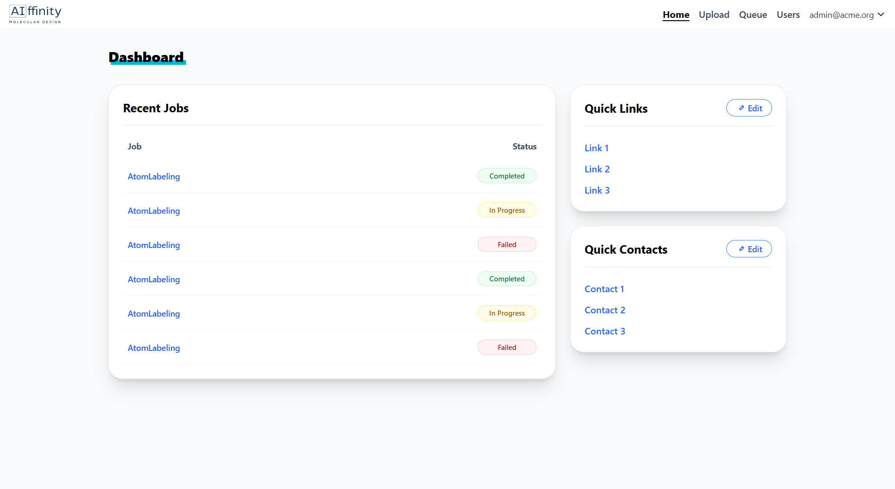
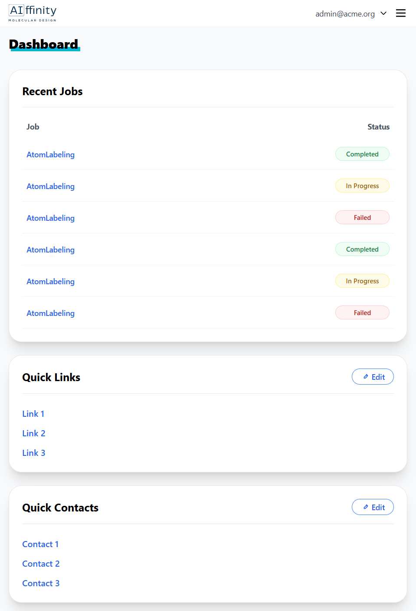
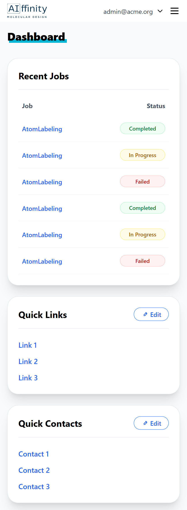
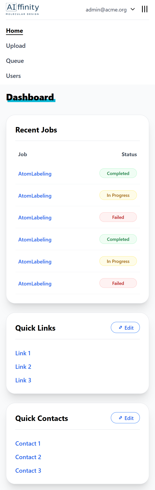

# AIffinity - Design Dashboard

## 🚀 Live Demo

**[View Live Site](https://bonuseto.github.io/aiffinity)**

## 📸 Screenshots

### Desktop View


### Tablet View


### Mobile Views
<table>
  <tr>
    <td width="50%">
      <h4>Navigation Closed</h4>
      
    </td>
    <td width="50%">
      <h4>Navigation Opened</h4>
      
    </td>
  </tr>
</table>

Before you begin, ensure you have the following installed:
- [Node.js](https://nodejs.org/) (version 16 or higher)
- [npm](https://www.npmjs.com/) (comes with Node.js)

## 🚀 Getting Started

### 1. Clone the Repository

```bash
git clone https://github.com/Bonuseto/aiffinity.git
cd aiffinity
```

### 2. Install Dependencies

```bash
npm install
```

### 3. Start Development Server

```bash
npm start
```
